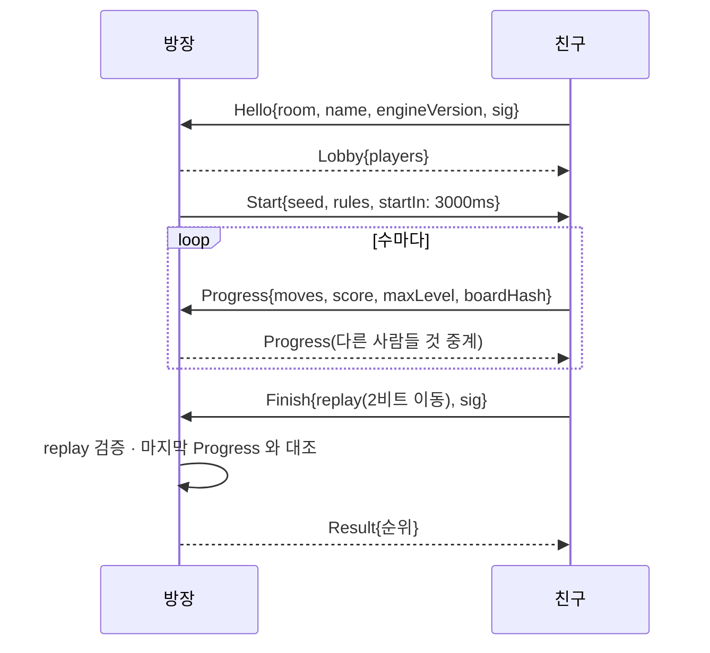

# Merge 게임 위젯 — 설계

> 상태: **설계만** (구현 전). 위젯 id 는 `merge`.
> 목표: 바탕화면 카드 안에서 한 판씩 하는 합치기(merge) 퍼즐 + 친구와 **점수 공유 / 실시간 대결**.
> 제약: **우리가 운영하는 서버 없이** 이 앱만으로.

## 0. 결론 먼저

| 단계 | 무엇 | 네트워크 | 외부 의존 |
|---|---|---|---|
| **P0** | 싱글 플레이 위젯 (4×4 슬라이드-합치기) | 없음 | 없음 |
| **P1** | **도전 코드**로 점수 공유 — 같은 시드, 리플레이로 검증, 서명으로 위조 방지 | 없음 (메신저에 붙여넣기) | 없음 |
| P1.5 | `deskboard://merge/…` 딥링크 — 링크 클릭으로 바로 열기 | 없음 | 없음 |
| **P2** | 같은 와이파이 실시간 대결 (iroh + mDNS) | LAN | 없음 |
| **P3** | 인터넷 실시간 대결 + 친구에게 신기록 자동 전송 (iroh) | 인터넷 P2P | n0 의 공개 relay·DNS (무료, SLA 없음) |

핵심 아이디어는 **결정론적 엔진**이다. 게임을 `(시드, 이동 목록)` 만으로 완전히 재현할 수 있게
만들면:

- 점수를 공유할 때 숫자가 아니라 **리플레이**를 보낸다 → 받는 쪽이 직접 다시 돌려 점수를 계산한다.
  서버가 없어도 "그 점수가 그 시드에서 실제로 나올 수 있다" 는 것이 증명된다.
- 실시간 대결에서 두 사람은 **같은 시드** = 같은 타일 출현 순서로 겨룬다. 운이 아니라 실력 비교.
- 보내는 데이터가 작다 (이동 한 번 = 2비트). 1,000수 판이 250바이트다.

"서버 없이" 를 엄격하게 지키는 것은 P0~P2 다. P3 은 우리가 서버를 돌리지는 않지만 n0 이
무료로 운영하는 relay 를 빌린다 — 이 경계를 설정에서 사용자가 고를 수 있게 한다 (§6.5).

---

## 1. 게임 규칙

### 1.1 장르 선택 — 왜 2048 계열인가

"Merge 게임" 에는 세 갈래가 있다. 위젯·네트워크 조건에서 비교했다:

| 갈래 | 예 | 위젯 적합성 | 결정론·리플레이 | 판정 |
|---|---|---|---|---|
| **슬라이드-합치기** | 2048, Threes | 작은 정사각형에 딱 맞음. 입력이 4방향뿐 | 정수 연산만 → **완전 결정론**. 이동 = 2비트 | **채택** |
| 물리 낙하-합치기 | 수박 게임(Suika) | 세로로 길어야 함. 프레임마다 물리 → 상시 CPU | 부동소수 물리는 WebView2 버전·CPU 에 따라 갈라질 수 있어 리플레이 검증 불가 | 탈락 |
| 보드 정리형 | Merge Mansion 류 | 넓은 화면·인벤토리 필요 | 결정론은 가능하나 점수 경쟁 구조가 아님 | 탈락 |

슬라이드-합치기는 **유휴 CPU 가 0** 이다 (이동할 때만 그린다) — 바탕화면에 상주하는 앱에서
중요하다 (CLAUDE.md 의 배경화면 블러 절에서 상시 CPU 를 0.5%p 단위로 깎은 이력 참고).

### 1.2 규칙 (클래식)

- 보드 `N×N` (기본 4, 설정으로 5). 셀은 비었거나 **레벨** `k ≥ 1` (표시 값 `2^k`).
- 한 수 = 상·하·좌·우 중 하나. 모든 타일이 그 방향으로 밀리고, 같은 레벨이 부딪히면 하나로
  합쳐 `k+1` 이 된다. **한 수에서 한 타일은 한 번만 합쳐진다** (`[2,2,2,2] → [4,4]`).
- 보드가 바뀐 수만 유효하다. 바뀌지 않은 방향은 무시하고 기록하지도 않는다.
- 유효한 수 다음에 빈 칸 하나에 새 타일: 레벨 1 (90%) / 레벨 2 (10%).
- 점수 = 합쳐서 생긴 타일 값의 합. 더 둘 수 없으면 끝.

### 1.3 모드

| 모드 | 끝나는 조건 | 공유 코드로 검증 가능? | 실시간 대결 |
|---|---|---|---|
| `classic` | 더 둘 수 없을 때 | ✅ | ✅ |
| `moves` | **정해진 수(예: 200수)** 를 다 쓰면 | ✅ | ✅ |
| `timed` | 정해진 시간(예: 3분) | ❌ — 시각은 위조 가능 | ✅ (방장이 진행 메시지로 판정) |

비동기 공유에 시간 제한을 두지 않는 이유: 리플레이에 시각을 적어 보내도 받는 쪽은 그게
진짜인지 알 수 없다. **수 제한(`moves`)은 리플레이 길이로 검증된다** — 그래서 "오늘의 도전"
기본 모드는 `moves` 다. 시간 제한은 양쪽이 동시에 접속해 있는 실시간 대결에서만 의미가 있다.

---

## 2. 결정론적 엔진 (`src/widgets/merge/engine.ts`)

**엔진은 TypeScript 하나만 둔다.** 같은 규칙을 Rust 에도 구현하면 두 구현이 어긋나는 순간
리플레이 검증이 거짓말을 한다. Rust 는 바이트를 저장·서명·운반만 하고, 점수 판정은 늘 프론트
엔진이 한다 (§4.3 의 신뢰 경계 참고).

```ts
export type Dir = 0 | 1 | 2 | 3;               // U R D L — 2비트
export interface Rules { size: 4 | 5; mode: "classic" | "moves" | "timed"; limit: number }
export interface State {
  cells: Uint8Array;   // 길이 size², 0 = 빈 칸, k = 레벨
  rng: Rng;            // 아래 PRNG 상태 (4×u32)
  score: number;
  moves: number;       // 유효했던 수의 개수
  over: boolean;
}
export function newGame(seed: string, rules: Rules): State;
export function step(s: State, d: Dir): { next: State; changed: boolean; merges: Merge[]; spawn?: Spawn };
export function replay(seed: string, rules: Rules, dirs: Iterable<Dir>): State;   // 검증용
```

- **순수 함수**. 렌더링과 애니메이션은 `step` 이 돌려준 `merges`/`spawn` 으로 그린다.
- **PRNG**: `cyrb128(seed)` → `sfc32` 상태 4개. 전부 `Math.imul` · `>>> 0` 정수 연산이라 JS
  엔진·CPU 와 무관하게 같은 값이 나온다. `Math.random` 은 엔진 어디에서도 쓰지 않는다.
- **출현 위치**는 "빈 칸들을 행 우선으로 늘어놓은 목록의 `rng() % 빈칸수` 번째", 레벨은
  `rng() % 10 === 0 ? 2 : 1`. 이 순서(위치 먼저, 레벨 나중)를 바꾸면 모든 옛 리플레이가 깨지므로
  **규칙 버전** `engineVersion = 1` 을 코드에 박고 공유 코드에도 싣는다.
- 판이 진행 중일 때 저장하는 것도 `(시드, 규칙, 이동 목록)` 뿐이다. 이어 하기 = `replay`.
  1,000수 재생은 1ms 안쪽이다(측정 필요 — vitest 벤치로 확인).

### 2.1 시드

| 종류 | 시드 문자열 | 쓰임 |
|---|---|---|
| 자유 | `free:<uuid>` | 혼자 하는 판 |
| 오늘의 도전 | `daily:2026-10-07:4x4:moves200` | 같은 날 친구끼리 같은 판 |
| 도전장 | 보낸 사람 판의 시드 그대로 | "이 판 이겨 봐" |
| 실시간 | `room:<방 id>:<라운드>` | 방장이 정해 배포 |

오늘의 도전 날짜는 **각자의 지역 날짜**다. 시드 문자열 자체가 코드에 실리므로 순위표는 시드로
묶인다 — 시차가 있는 친구도 같은 시드를 받으면 같은 판이다.

### 2.2 정직하게 말해 둘 한계

결정론의 대가로, 같은 시드를 **다시 시작하면 출현 순서를 외울 수 있다**. 서버 없이는 막을
방법이 없다 (서버가 있어도 클라이언트에 엔진이 있으면 마찬가지다). 그래서 막지 않고 **드러낸다**:

- 시드마다 **시도 횟수**를 로컬에 세고 (`attempt`), 공유 코드에 서명해 싣는다.
- 순위표는 기본으로 "첫 시도" 기록을 보여 주고, 재도전 기록에는 `(3번째)` 를 붙인다.

봇·솔버로 돌린 리플레이도 검증을 통과한다. 친구끼리의 놀이라는 범위에서 감수한다.

---

## 3. 위젯 (P0)

```
src/widgets/merge/
├─ index.ts          WidgetDefinition — defaultSize 300×360, minSize 180×200
├─ Merge.tsx         보드 + 머리줄(점수·최고) + 바닥줄(모드·공유)
├─ Merge.css
├─ engine.ts         §2 — 순수 함수
├─ engine.test.ts    골든 리플레이(시드+이동 → 점수·보드 해시 고정), 합치기 규칙 표
├─ code.ts           §4 공유 코드 인코딩/디코딩 (서명은 Rust)
└─ code.test.ts
```

### 3.1 설정 스키마

```ts
settingsSchema: [
  { key: "size",     label: "보드 크기", type: "select", default: "4", options: [{value:"4",label:"4×4"},{value:"5",label:"5×5"}] },
  { key: "mode",     label: "기본 모드", type: "select", default: "classic", options: [...] },
  { key: "nickname", label: "내 이름(공유 코드에 실림)", type: "text", default: "", placeholder: "친구에게 보일 이름" },
  { key: "online",   label: "실시간 대결 켜기", type: "select", default: "off",
    options: [{value:"off",label:"끔"},{value:"lan",label:"같은 네트워크만"},{value:"internet",label:"인터넷 (n0 relay 사용)"}] },
  { key: "note",     label: "…relay 를 쓰면 연결 중계에 n0.computer 의 공개 서버를 거칩니다…", type: "note", showIf: {key:"online", equals:"internet"} },
]
```

진행 중인 판은 **위젯 설정에 넣지 않는다** — 수마다 `settings.json` 을 다시 쓰게 된다.
`merge.sqlite` 의 `sessions` 에 인스턴스별로 두고, 이동 후 1초 디바운스 + 트레이 종료 시 저장.

### 3.2 입력 — 이 앱에서 가장 까다로운 부분

**포인터(스와이프)를 기본으로 한다.** 보드 위에서 `pointerdown → pointerup` 의 변위가
`max(16px, 보드의 6%)` 를 넘으면 큰 축 방향으로 한 수. `touch-action: none`, 편집 모드
(`editing`)에서는 입력을 받지 않는다 (카드를 끌어야 하니까).

**키보드(방향키·WASD)는 그대로는 동작하지 않는다.** `window.rs::give_focus_back_if_idle` 이
위젯을 누른 뒤 250ms 에 포커스를 원래 앱으로 돌려주기 때문이다 — 입력 요소가 포커스를 쥐었을
때만 예외다(`App.tsx` 의 `editable()` → `ui_set_text_focus`). 그래서:

- 보드 요소를 `tabIndex={0}` + `data-capture-keys` 로 표시하고,
- `App.tsx` 의 `editable()` 에 `[data-capture-keys]` 를 한 줄 더한다.

```ts
!!el && (el.matches("input, textarea, select, [data-capture-keys]") || (el as HTMLElement).isContentEditable)
```

보드를 클릭하면 포커스를 쥐고, 바탕화면이나 다른 앱을 누르면 자연히 풀린다. 이 동안 대시보드가
전경이라 잠깐 다른 앱 위로 올라올 수 있는데, 이건 이미 허용된 동작이다 (CLAUDE.md "전경이 우리일
때는 내리지 않는다"). 위젯 공통 장치를 하나 늘리는 변경이므로 구현 PR 에서 CLAUDE.md 의 해당
절도 함께 고친다.

Esc 는 `App.tsx` 가 이미 "선택 해제 → 잠금" 에 쓴다. 게임은 Esc 를 쓰지 않는다.

### 3.3 그리기

- 색은 규칙대로 `theme.css` 변수만. 타일 색은 레벨로 계산한다:
  `color-mix(in oklab, var(--accent) <p>%, var(--surface-strong))`, `p = min(100, 12 + 8k)`.
  글자색은 `p > 55` 이면 `var(--on-text)` 아니면 `var(--text)`. 팔레트(dark/light)·카드 스타일을
  따라 저절로 바뀐다. 레벨 11(2048) 이상은 `--warn`/`--danger` 쪽으로 섞어 눈에 띄게 한다.
- 이동 애니메이션은 `transform` + `--dur-fast` 만. `requestAnimationFrame` 루프를 두지 않는다
  — 유휴 CPU 0. `prefers-reduced-motion` 은 theme.css 가 전역 처리.
- 크기 대응: 짧은 변 < 220px 이면 머리줄을 점수 하나로 줄이고 바닥줄을 감춘다(공유는 ⋯ 메뉴로).
- 공유·방 팝업이 카드 밖으로 나가면 `setOverlayRect` 로 히트 영역 등록, 닫기는 `useDismiss`.

### 3.4 백엔드 (`providers/merge`, P0 부분)

```
src-tauri/src/providers/merge/
├─ mod.rs     Provider + 커맨드
├─ store.rs   MergeStore 트레이트 + SqliteStore (notes 와 같은 꼴, in_memory 로 테스트)
├─ code.rs    (P1) 서명·검증
├─ identity.rs(P1) 키 생성·DPAPI 저장
└─ net/       (P2~) iroh
```

`merge.sqlite`:

```sql
CREATE TABLE sessions (           -- 진행 중인 판, 인스턴스마다 하나
  instance_id TEXT PRIMARY KEY, seed TEXT, rules TEXT, moves BLOB, updated_at INTEGER);
CREATE TABLE results (            -- 끝난 판 (내 것 + 친구 것)
  id INTEGER PRIMARY KEY, seed TEXT, rules TEXT, player TEXT /* 공개키 hex, 나는 'me' 아닌 실제 키 */,
  name TEXT, score INTEGER, max_level INTEGER, moves INTEGER, attempt INTEGER,
  replay BLOB, sig BLOB, finished_at INTEGER, received_at INTEGER,
  UNIQUE(player, seed, attempt));
CREATE TABLE attempts (seed TEXT PRIMARY KEY, n INTEGER);
CREATE TABLE friends (            -- P1 부터: 코드를 받으면 자동 추가, 이름은 사용자가 바꿀 수 있음
  player TEXT PRIMARY KEY, nickname TEXT, added_at INTEGER, last_seen INTEGER);
```

커맨드(P0): `merge_session_get(instance_id)` · `merge_session_save(instance_id, seed, rules, moves)` ·
`merge_session_clear` · `merge_result_put(result)` · `merge_results(seed?)` · `merge_attempt_next(seed)`.
변경 시 `merge://changed`.

---

## 4. 도전 코드 — 서버 없는 점수 공유 (P1)

### 4.1 흐름

```
나: 판을 끝냄 → [공유] → 코드 복사 (navigator.clipboard.writeText)
     ↓   카카오톡·디스코드 등 아무 메신저
친구: 위젯 [코드 넣기] 입력란에 붙여넣기
     → Rust: 형식·서명 검증 → 프론트: 엔진으로 리플레이 → 점수 일치?
     → results 에 저장, friends 에 보낸 사람 추가
     → "민수의 오늘의 도전: 18,420점 (첫 시도) — 나도 도전" 버튼 → 같은 시드로 새 판
```

친구가 같은 시드로 판을 끝내면 순위표(그 시드의 results)에 나란히 뜨고, 자기 코드를 돌려보낼 수 있다.
붙여넣기는 **입력란**으로 받는다 — 클립보드 읽기 권한이 필요 없고, 입력란이라 포커스 문제도 없다.

### 4.2 코드 형식

```
DBM1.<base64url(payload)>.<base64url(sig)>
```

`payload` (리틀엔디언, 고정 순서):

| 필드 | 크기 | |
|---|---|---|
| format | 1 | `1` |
| engineVersion | 1 | §2 |
| rules | 2 | size(4b)·mode(2b)·limit(10b) |
| seed | 1 + n | 길이 + UTF-8 |
| attempt | 1 | 255 에서 포화 |
| score | 4 | 받는 쪽은 **믿지 않고** 리플레이 결과와 비교만 |
| moveCount | 2 | |
| moves | ⌈moveCount/4⌉ | 2비트씩 묶음 |
| finishedAt | 4 | 유닉스 초 |
| name | 1 + n | ≤ 24바이트 |
| pubkey | 32 | ed25519 |

크기: 200수 `moves` 모드 ≈ 50 + 50 + 64(서명) ≈ 170바이트 → 코드 약 230자. 1,500수 클래식도
≈ 500바이트 → 약 700자. 메신저 한 줄에 들어간다.

### 4.3 신원과 서명

- 설치마다 **ed25519 키 한 쌍**. 비밀키 32바이트는 `providers/secrets` (DPAPI) 로
  `merge-id.dat` 에 둔다 — 규칙대로 새 비밀값은 평문으로 두지 않는다.
- 공개키가 곧 **플레이어 id** 다. 이름은 누구나 같은 걸 쓸 수 있으니 순위표는 키로 묶고, 처음 보는
  키는 "새 친구" 로 표시한다 (이름이 같은 다른 사람을 구별할 수 있게 공개키 앞 4글자를 작게 보인다).
- **같은 키를 P3 의 iroh `EndpointId` 로 재사용한다** (iroh 의 노드 id 도 ed25519 공개키다).
  코드로 받은 친구를 그대로 "실시간으로 부를 수 있는 친구" 로 쓸 수 있다.
- 서명은 Rust 가 한다 (비밀키가 프론트로 나가지 않는다):
  `merge_share_create(seed, rules, moves, score, attempt, name) -> String`
  `merge_share_open(code) -> Payload` (형식·서명 검증까지만, 점수는 판정하지 않음)
- **신뢰 경계**: 믿지 않는 것은 네트워크·클립보드에서 들어온 바이트다. 그 바이트는
  Rust(서명) → 프론트(`replay` 로 점수 재계산, `score`·`moveCount`·`mode` 한도와 대조) 를
  모두 통과해야 `merge_result_put` 으로 들어간다. 우리 프론트와 백엔드는 같은 앱이라 서로 믿는다.
- 키를 잃으면(윈도우 재설치) 새 사람이 된다. 친구 목록에서 이름 옆 키가 바뀐 걸로 알 수 있다.
  내보내기/가져오기는 남은 일.

크레이트: `ed25519-dalek` (P1). P3 에서는 iroh 가 같은 곡선을 쓰므로 iroh 의 `SecretKey` 로 옮기거나
같은 32바이트로 만든다.

### 4.4 딥링크 (P1.5, 선택)

코드를 `deskboard://merge/DBM1....` 링크로도 낸다. 메신저에서 클릭하면 앱이 열리며 코드를 받는다.

- `tauri-plugin-deep-link` + `tauri-plugin-single-instance` 의 `deep-link` 기능. Windows 에서는 링크가
  **새 프로세스의 명령줄 인자**로 오므로 단일 인스턴스가 받아 기존 창으로 넘겨야 한다.
- 단일 인스턴스가 **release 빌드에서만** 걸려 있으므로 `tauri dev` 에서는 확인할 수 없다 —
  개발 중엔 붙여넣기 입력란으로 테스트한다.
- 스킴 등록은 설치 시 HKCU 에 된다 (`installMode: currentUser` 와 맞음).
- 받은 링크는 신뢰하지 않는 입력이다 — 열자마자 판을 바꾸지 말고 "민수의 도전이 도착했어요" 카드만 띄운다.

---

## 5. 실시간 대결 — 설계 대안 비교

"우리 서버 없이" 실시간으로 두 컴퓨터를 잇는 방법을 비교했다.

| 방법 | NAT 너머 연결 | 서버 필요 | 구현 위치 | 판정 |
|---|---|---|---|---|
| **iroh 1.0** (QUIC, 공개키로 다이얼) | 홀펀칭, 실패 시 relay 로 자동 전환 | n0 공개 relay·DNS (무료, 운영 불필요) / LAN 은 mDNS 로 0 | Rust (tokio 이미 있음) | **채택** |
| WebView2 WebRTC (DataChannel) + 수동 SDP 교환 | STUN 만 → 대칭 NAT 에서 실패, TURN 은 서버 필요 | Google STUN 정도 | JS | 탈락 — 초대에 **코드를 두 번 주고받아야** 한다(offer→answer). UX 가 나쁘고 실패 시 대안이 없다 |
| rust-libp2p | 홀펀칭(DCUtR) + 릴레이 | 공개 부트스트랩·릴레이 필요 | Rust | 탈락 — 같은 일을 하는데 설정 표면이 훨씬 넓다 |
| 순수 LAN (UDP 브로드캐스트 + TCP) | 불가 | 없음 | Rust | iroh 의 mDNS 모드로 대체 (같은 코드로 LAN/인터넷) |
| Nostr 공개 릴레이 | — (비동기 게시판) | 제3자 릴레이 | Rust/JS | 보류 — 비동기 순위표엔 쓸 만하지만 실시간에 안 맞고, 남의 릴레이에 기록이 공개로 남는다 |
| GitHub Gist (이미 PAT 가 있음) | — | GitHub | Rust | 탈락 — 친구도 GitHub 계정·`gist` 스코프가 필요 |
| 직접 서버 (Cloudflare Worker 등) | — | **우리 서버** | — | 요구사항 위반 |

### iroh 를 고른 이유

- **1.0 (2026-06-15)** 에서 와이어 프로토콜이 안정화됐다. n0 공개 relay 는 무료·취미 용도에 계속
  열려 있지만 **SLA 가 없고, 트래픽 속도 제한이 있고, 최신 안정판만 공식 지원**한다 — 우리 트래픽은
  초당 몇 바이트라 속도 제한과 무관하고, 업데이터가 이미 있어 버전을 따라가기 쉽다.
- **공개키로 다이얼**한다 → §4.3 의 플레이어 id 가 그대로 주소가 된다. 초대 코드에 IP 가 필요 없다.
- 홀펀칭이 실패해도 **relay 로 자동 전환**되므로 "연결 안 됨" 이 거의 없다. relay 경유 시에도
  종단 간 암호화(QUIC/TLS) 라 relay 는 내용을 볼 수 없다.
- **mDNS 주소 탐색**(`address-lookup-mdns` 기능)으로 같은 네트워크에서는 relay 를 아예 끄고
  (`RelayMode::Disabled`) 외부 의존 0 으로 돌릴 수 있다 → P2 와 P3 이 같은 코드다.
- relay 가 언젠가 사라져도 `iroh-relay` 를 직접 띄우는 길이 있다 (그땐 "우리 서버" 가 되지만 선택지는 남는다).

---

## 6. 실시간 대결 설계 (P2·P3)

### 6.1 구성

```
Merge.tsx ──invoke──▶ providers/merge/net (Rust, tokio)
    ▲                     │ iroh::Endpoint (ALPN "deskboard/merge/1")
    └── merge://net ◀─────┘ 연결 상태·방 상태·상대 진행·도착한 결과
```

- 네트워크는 **위젯의 `online` 설정이 켜져 있고 위젯이 떠 있을 때만** 연다.
  `merge_set_online(mode)` 를 `invokeInOrder` 로 보낸다 (StrictMode 의 켜기→끄기→켜기 순서 문제,
  CLAUDE.md 규칙). 위젯이 사라지면 Endpoint 를 닫는다 — 상시 relay keepalive 를 남기지 않는다.
- 엔드포인트 비밀키 = §4.3 의 키.

### 6.2 방 (2~4명, 방장 중심 별 모양)

방장이 `room id`(16바이트 랜덤)를 만들고 초대 코드를 낸다:

```
DBR1.<방장 EndpointId(z-base32)>.<room id(base64url)>
```

인터넷 모드에선 EndpointId 만으로 n0 DNS 탐색이 주소를 찾는다. LAN 모드에선 mDNS 가 찾는다.
친구 목록에 있는 사람이면 코드 없이 "초대" 버튼으로 바로 부른다 (상대 앱이 온라인이어야 함).

참가자는 방장에게만 QUIC 연결을 맺고, 방장이 모두에게 중계한다 — 4명이면 연결 3개.
gossip(`iroh-gossip`)은 인원이 커질 때나 필요하다 — 지금은 쓰지 않는다.



### 6.3 메시지

- 하나의 양방향 스트림에 **길이 접두 JSON** (`u32 len + serde_json`). 메시지가 작고 드물어(수당 1개)
  CBOR 까지 갈 이유가 없다. `type` 태그를 둔 serde enum.
- `Hello` 의 `engineVersion` 이 다르면 거절하고 "상대가 다른 버전입니다 — 업데이트" 를 띄운다.
- `Progress.boardHash` 는 보드 셀의 FNV-1a — 방장이 나중에 리플레이 중간값과 대조해,
  진행 중에 보낸 점수와 최종 리플레이가 같은 판이었는지 확인한다.

### 6.4 판정

- `classic` / `moves`: 모두 끝나면 각자의 `Finish.replay` 를 **방장의 프론트 엔진이** 검증해 순위.
- `timed`: 방장 시각 기준 `startAt + limit` 시점까지 **도착한** 마지막 `Progress` 의 이동 수까지만
  리플레이에 인정한다. 시계 동기는 `Start` 의 `startIn`(상대 시간)으로 피한다 — 절대 시각을 맞추지 않는다.
  RTT 의 절반만큼 방장 쪽이 유리하다; 친구끼리 감수한다.
- 끊기면: 방장은 그 사람 마지막 `Progress` 로 순위를 매기고 "(끊김)" 을 붙인다. 방장이 끊기면 판 무효.
- 결과는 각자의 `results` 에 저장되고 §4 의 공유 코드로도 내보낼 수 있다.

### 6.5 친구에게 신기록 자동 전송 (P3)

온라인일 때 내 기록이 그 시드의 개인 최고를 넘으면, `friends` 중 **지금 다이얼되는** 사람에게
`Finish` 와 같은 내용(서명된 코드 바이트 그대로)을 한 번 보낸다. 받는 쪽은 §4.3 과 똑같이
검증해 넣는다 — 경로만 다를 뿐 공유 코드와 같은 파이프라인이다. 상대가 오프라인이면 버린다
(우리는 메시지를 맡아 줄 서버가 없다 — 다음 접속 시 서로 "최근 기록 요약" 을 한 번 주고받는 것으로 메운다).

### 6.6 사용자가 알아야 할 것 (설정 패널의 note 로)

- 인터넷 모드는 n0.computer 의 공개 relay·DNS 를 거친다: 상대에게 **IP 주소가 보일 수 있다**
  (직접 연결이 되면 당연히). relay 는 내용은 못 보지만 누가 누구와 연결하는지는 안다.
- 처음 켤 때 **Windows 방화벽 허용 창**이 뜰 수 있다 (UDP 소켓을 열기 때문. 특히 mDNS 수신).
  `installMode: currentUser` 라 설치 훅에서 관리자 권한으로 규칙을 넣을 수 없다 — 거부해도
  relay 경유로는 대개 동작한다. **실측 필요**.

---

## 7. 비용·위험

| 항목 | 내용 | 대응 |
|---|---|---|
| 설치 파일 크기 | iroh 와 그 의존(quinn·rustls·hickory 등)이 붙는다. rustls·tokio 는 이미 있음 | P2 착수 전에 `cargo bloat`/설치본 크기 **실측**. 크면 `merge-net` cargo feature 로 분리 |
| 상시 비용 | 네트워크는 위젯이 떠 있고 `online` 이 켜졌을 때만 | 배경화면 블러처럼 켬/끔 CPU·트래픽 실측을 PR 에 남긴다 |
| relay 정책 변경 | n0 가 무료 relay 를 바꾸거나 옛 버전 지원을 끊을 수 있음 | 1.0 은 EOL 까지 지원 예정. 업데이터로 따라간다. 최후엔 LAN 모드·공유 코드는 영향 없음 |
| 엔진 규칙 변경 | 옛 리플레이·다른 버전 친구와 어긋남 | `engineVersion` 을 코드·Hello 에 싣고, 엔진은 옛 버전을 **지우지 않고** 버전별 분기 |
| 부정행위 | 같은 시드 반복, 솔버 | §2.2 — 막지 않고 시도 횟수를 서명해 드러냄 |
| 키 분실 | 재설치 시 새 사람 | 키 내보내기/가져오기는 남은 일 |

## 8. 테스트

- **엔진 (vitest)**: 합치기 규칙 표(`[2,2,2,2]→[4,4]`, `[2,2,4]→[4,4]` 등 4방향), 무효 수가 rng 를
  소비하지 않음, **골든 리플레이** — 고정 시드·이동 목록 → 최종 보드 해시·점수를 상수로 박는다.
  엔진을 고치다 이 테스트가 깨지면 `engineVersion` 을 올려야 한다는 뜻이다.
- **코드 (vitest + cargo test)**: 인코딩 왕복, 2비트 묶음 경계(이동 수가 4의 배수가 아닐 때),
  잘린 코드·잘못된 서명·다른 키의 서명 거부, payload 의 `score` 를 조작하면 리플레이 대조에서 거부.
  Rust 가 만든 코드를 TS 가 읽는 교차 픽스처를 `src/widgets/merge/fixtures/` 에 둔다.
- **저장소 (cargo test)**: `SqliteStore::in_memory()` 로 results UNIQUE·attempt 증가·친구 자동 추가.
- **네트워크 (cargo test)**: 한 프로세스에 iroh Endpoint 두 개를 relay 없이(로컬 주소 직접) 띄워
  Hello→Start→Progress→Finish 왕복. 외부 망에 의존하는 테스트는 두지 않는다 (CI 는 windows-latest).
  방 상태기계는 네트워크와 떼어 순수 함수로 두고 따로 테스트한다.

## 9. 구현 순서와 크기 (대략)

1. **P0** — `engine.ts`(+테스트) → `Merge.tsx` 스와이프 → `App.tsx` `data-capture-keys` →
   `providers/merge` sessions/results → registry 한 줄. 의존 추가 없음.
2. **P1** — `identity.rs`(DPAPI) · `code.rs`(`ed25519-dalek`) · 공유/붙여넣기 UI · 시드별 순위표 · 오늘의 도전.
3. P1.5 — deep-link 플러그인 + single-instance `deep-link` 기능.
4. **P2** — `iroh` (+`address-lookup-mdns`), LAN 방 만들기/참가, 크기·CPU 실측.
5. **P3** — 인터넷 모드(relay·DNS), 친구 초대, 신기록 자동 전송.

각 단계는 앞 단계 없이도 쓸모가 있다. P1 까지만 해도 "이 앱만으로 친구와 점수 겨루기" 는 완성된다.

## 10. 열린 질문

- 장르는 2048 계열로 가정했다. 수박 게임 같은 물리 낙하형을 원하면 §1.1 의 이유로
  **리플레이 검증을 포기**하고 점수만 서명해 공유하는 쪽으로 바뀐다 (P1 의 신뢰도가 크게 떨어진다).
- P3 의 n0 relay 사용을 받아들일지 — 안 받아들이면 실시간 대결은 같은 네트워크(P2)까지만.
- 실시간 대결을 같은 판 경주로 할지, 테트리스 대전처럼 **상대에게 방해 타일을 보내는** 대결로 할지.
  후자는 서로의 행동이 서로의 판에 끼어들어 리플레이가 상대 입력에 의존하게 된다 — 결정론은 유지되지만
  (`Attack` 메시지를 리플레이에 함께 기록) 검증과 판정이 한 단계 복잡해진다. 첫 버전은 경주로 제안한다.
